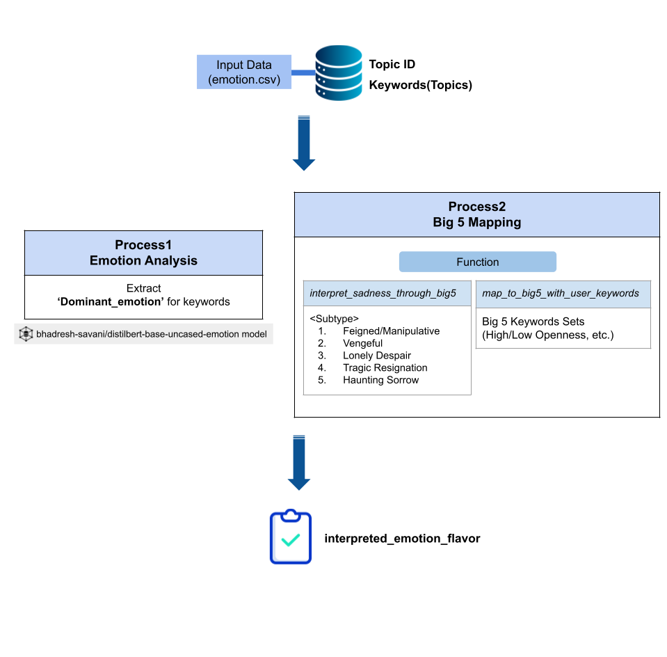
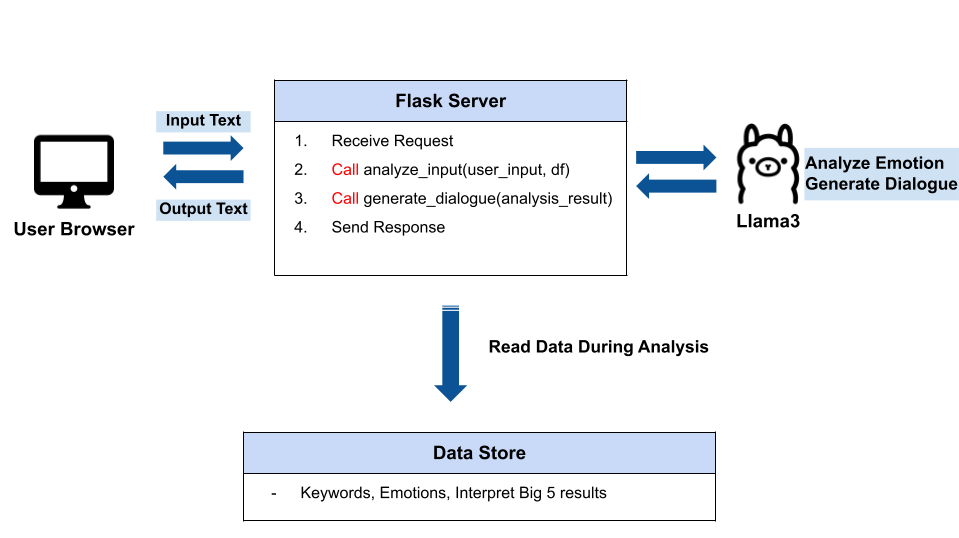
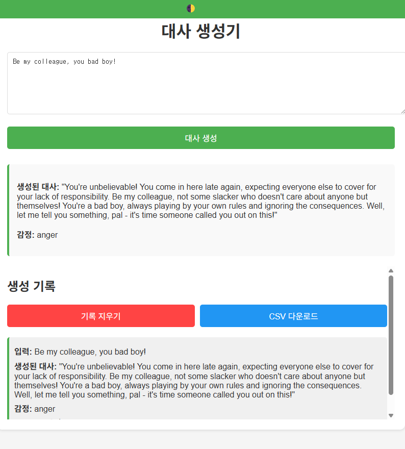

# VDialogueB5

홍익대학교 일반대학원 게임학부 석사 과정 졸업프로젝트 웹 기반 < Big 5 성격 특성 모델 기반 악인 대사 자동 생성 > 프로토타입의 코드입니다.

* 필요 조건 1 로컬 환경의 Llama3를 설치해주세요.
* 필요 조건 2 가상환경을 설치해주세요.
* requirments.txt 설치 후 사용해 주세요.
```
pip install -r requirements.txt
```

Arechitecture <br>
----------

*1. 자동 대사 생성의 전체적 구조*


*2. 웹 기반 대사 생성 프로토타입의 전체적 구조*



Web Prototype <br>
----------

*프로토타입 예시*


